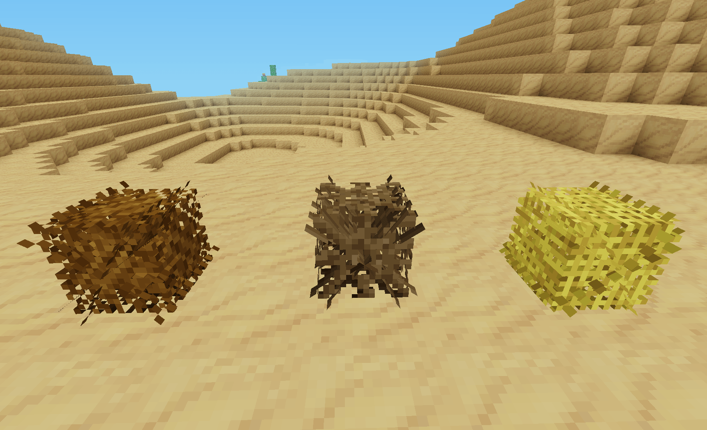

# X Tumbleweed [x_tumbleweed]

Adds tumbleweed.

## Features

* spawns in deser, sandstone desert and cold deser by default
* have a ~33% change to split down to smaller tumbleweeds when broken
* drops decoration items from the biome where it was broken
* has various sizes and textures

## Dependencies

- mobkit

## Optional Dependencies

- none

## License:

### Code

GNU Lesser General Public License v2.1 or later (see included LICENSE file)

### Textures

**CC-BY-SA-4.0, Pixel Perfection by XSSheep**, https://minecraft.curseforge.com/projects/pixel-perfection-freshly-updated

- x_tumbleweed_death_particle_animated.png

**CC-BY-SA-4.0, by SaKeL**

- x_tumbleweed_tumbleweed_1.png
- x_tumbleweed_tumbleweed_2.png
- x_tumbleweed_tumbleweed_3.png

### Models

**CC-BY-SA-4.0, by SaKeL**

- x_tumbleweed_tumbleweed.b3d

### Sounds

-

## Installation

see: https://wiki.minetest.net/Installing_Mods
